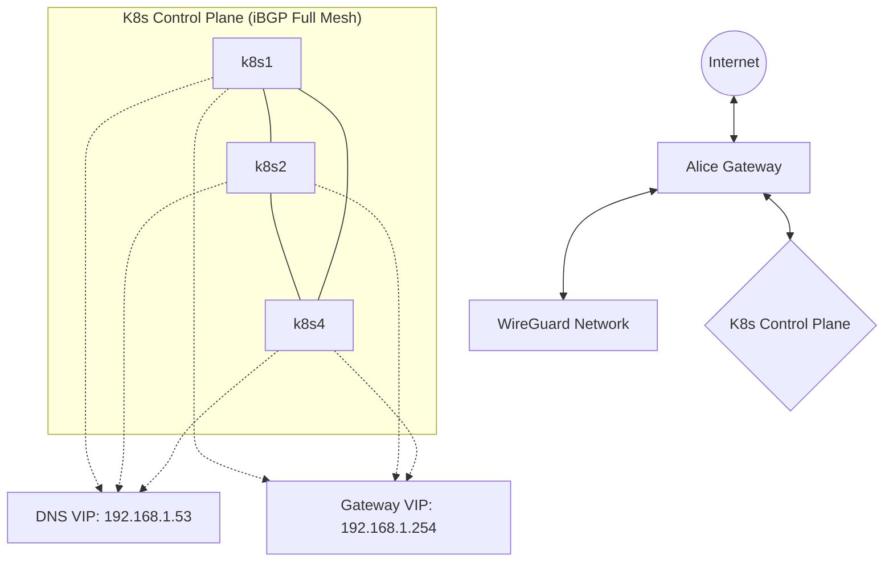

# ネットワーク構成ドキュメント

このドキュメントでは、kigawa-net インフラストラクチャのネットワーク構成について説明します。

## 概要

本ネットワークは、BGPによる動的ルーティング、VRRP (Keepalived) による高可用性、およびWireGuardによるVPN接続を組み合わせたハイブリッド構成となっています。

## コンポーネント

### 1. BGP ルーティング (Bird / FRR)

ネットワーク全体のルーティング制御にBGPを使用しています。

- **iBGP フルメッシュ**: Kubernetes コントロールプレーンノード（k8s1, k8s2, k8s4）間でiBGPフルメッシュが構成されています。
    - **ソフトウェア**: [Bird2](https://bird.network.cz/)
    - **設定ファイルパス**: `/etc/bird/bird.conf`
    - **ピアリング設定**: 各ノードの `bird.conf` に、他のコントロールプレーンノードが隣接ノードとして定義されています。
- **AS番号**: `65000` を主に使用しています。
- **広告ルート**:
    - **DNS VIP (192.168.1.53)**: 各コントロールプレーンノードが自身にこのIPをアサインし、BGP経由で広告します。
    - **Kubernetes サービスネットワーク**: kube-vip 等を通じて広告される場合があります。
- **Alice Gateway (FRR)**: `alice` ノードで [FRR (Free Range Routing)](https://frrouting.org/) が動作しています。
    - **役割**: 外部ピアとの接続、OSPFによる内部ルートの学習、WireGuardインターフェース経由のルーティング。

### 2. DNS インフラストラクチャ

高可用なDNSリゾルバーサービスを提供しています。

- **DNS VIP**: `192.168.1.53`
    - このIPはBGPによってネットワーク全体に広告され、Anycastのように最も近い（またはECMPによって分散された）ノードがリクエストを処理します。
- **Knot Resolver (kresd)**:
    - 各コントロールプレーンノードでコンテナまたはサービスとして動作。
    - `/etc/knot-resolver/kresd.conf` にて、`0.0.0.0` および `DNS VIP (192.168.1.53)` で Listen するよう設定されています。
- **Knot DNS (Authority)**:
    - 権威DNSサーバーとして動作。
    - 管理ゾーン: `kigawa.net`, `onemc.world`
    - ゾーンファイルは `hardware/zones/` 下で管理されています。

### 3. 高可用性 (VRRP / Keepalived / kube-vip)

- **Keepalived (VRRP)**:
    - Terraformモジュール `hardware/modules/keepalived` を通じて管理されます。
    - **VRRP (Virtual Router Redundancy Protocol)** を使用して、特定の物理インターフェース上でVIPを浮動させます。
    - **役割**: 主にゲートウェイや特定のサービスにおけるVIPの冗長化に使用されます。
    - **設定**: `/etc/keepalived/keepalived.conf` にて VRRP インスタンス、優先度（Priority）、仮想ルーターID（Virtual Router ID）、認証パスワード、および管理対象のVIPが定義されます。
- **kube-vip**:
    - Kubernetes コントロールプレーンのAPIサーバー VIP (例: 192.168.1.100) を管理します。
    - **BGPモード**: 本環境ではBGPモードを推奨し、ARPモードは利用しません。これにより、レイヤー2の制限を受けずに柔軟なルーティングが可能になります。
    - 各コントロールプレーンノード上でスタティックポッドとして動作し、APIサーバーの可用性を担保します。

### 4. ゲートウェイ (Alice)

`alice` ノードは、ネットワークの境界ゲートウェイとして以下の機能を果たします。

- **FRR**:
    - BGP/OSPFによるルーティング制御。
    - 外部ネットワークへのルート集約や、内部ネットワークへのデフォルトルートの配布などを行います。
- **HAProxy**:
    - 外部（インターネット）からのリバースプロキシとして動作。
    - SSL終端を行い、バックエンドの各サービス（Kubernetes Ingressなど）にトラフィックを振り分けます。
- **WireGuard**:
    - `wg0` インターフェースを使用し、外部拠点やモバイルクライアントとのセキュアな通信路を提供します。
    - WireGuardネットワーク内のルーティングはFRRによって管理される場合があります。

## IPアドレス設計

| IPアドレス | 用途 | 管理方法 |
|-----------|------|---------|
| 192.168.1.1 | 物理ルーター | 静的割当 |
| 192.168.1.254 | デフォルトゲートウェイ VIP | Keepalived (VRRP) |
| 192.168.1.53 | DNS VIP | Bird (BGP広告) |
| 192.168.1.100 | K8s API VIP | kube-vip |
| 192.168.1.103 | k8s1 (Node) | 静的割当 |
| 192.168.1.104 | k8s2 (Node) | 静的割当 |
| 192.168.1.120 | k8s4 (Node) | 静的割当 |
| 10.244.0.0/16 | Pod ネットワーク | Flannel |
| 10.96.0.0/12 | Service ネットワーク | Kubernetes |

## ネットワーク図 (論理構成)

