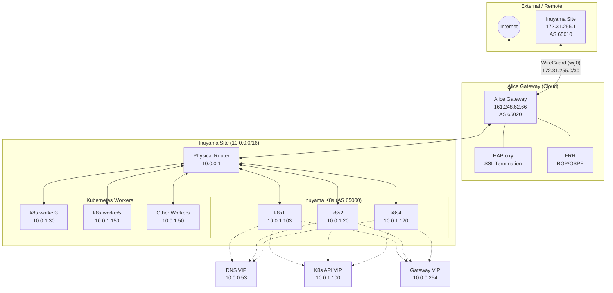
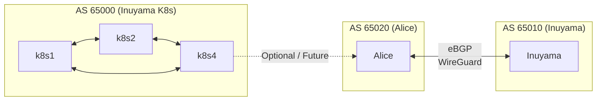

# ネットワーク構成ドキュメント

このドキュメントでは、kigawa-net インフラストラクチャのネットワーク構成について説明します。

## 概要

本ネットワークは、BGPによる動的ルーティング、VRRP (Keepalived) による高可用性、およびWireGuardによるVPN接続を組み合わせたハイブリッド構成となっています。

## コンポーネント

### 1. BGP ルーティング (Bird / FRR)

ネットワーク全体のルーティング制御にBGPを使用しています。

- **iBGP フルメッシュ**: Kubernetes コントロールプレーンノード（k8s1, k8s2, k8s4）間でiBGPフルメッシュが構成されています。
    - **ソフトウェア**: [Bird2](https://bird.network.cz/)
    - **設定ファイルパス**: `/etc/bird/bird.conf`
    - **ピアリング設定**: 各ノードの `bird.conf` に、他のコントロールプレーンノードが隣接ノードとして定義されています。
- **AS番号**: `65000` (Inuyama K8s) を主に使用しています。
- **広告ルート**:
    - **DNS VIP (10.0.0.53)**: 各コントロールプレーンノードが自身にこのIPをアサインし、BGP経由で広告します。
    - **Kubernetes サービスネットワーク**: kube-vip 等を通じて広告される場合があります。
- **Alice Gateway (FRR)**: `alice` ノードで [FRR (Free Range Routing)](https://frrouting.org/) が動作しています。
    - **役割**: 外部ピアとの接続、OSPFによる内部ルートの学習、WireGuardインターフェース経由のルーティング。

### 2. DNS インフラストラクチャ

高可用なDNSリゾルバーサービスを提供しています。

- **DNS VIP**: `10.0.0.53`
    - このIPはBGPによってネットワーク全体に広告され、Anycastのように最も近い（またはECMPによって分散された）ノードがリクエストを処理します。
- **Knot Resolver (kresd)**:
    - 各コントロールプレーンノードでコンテナまたはサービスとして動作。
    - `/etc/knot-resolver/kresd.conf` にて、`0.0.0.0` および `DNS VIP (10.0.0.53)` で Listen するよう設定されています。
- **Knot DNS (Authority)**:
    - 権威DNSサーバーとして動作。
    - 管理ゾーン: `kigawa.net`, `onemc.world`
    - ゾーンファイルは `hardware/zones/` 下で管理されています。

### 3. 高可用性 (VRRP / Keepalived / kube-vip)

- **Keepalived (VRRP)**:
    - Terraformモジュール `hardware/modules/keepalived` を通じて管理されます。
    - **VRRP (Virtual Router Redundancy Protocol)** を使用して、特定の物理インターフェース上でVIPを浮動させます。
    - **役割**: 主にゲートウェイや特定のサービスにおけるVIPの冗長化に使用されます。
    - **設定**: `/etc/keepalived/keepalived.conf` にて VRRP インスタンス、優先度（Priority）、仮想ルーターID（Virtual Router ID）、認証パスワード、および管理対象のVIPが定義されます。
- **kube-vip**:
    - Kubernetes コントロールプレーンのAPIサーバー VIP (例: 10.0.1.100) を管理します。
    - **BGPモード**: 本環境ではBGPモードを推奨し、ARPモードは利用しません。これにより、レイヤー2の制限を受けずに柔軟なルーティングが可能になります。
    - 各コントロールプレーンノード上でスタティックポッドとして動作し、APIサーバーの可用性を担保します。

### 4. ゲートウェイ (Alice)

`alice` ノードは、ネットワークの境界ゲートウェイとして以下の機能を果たします。

- **FRR**:
    - BGP/OSPFによるルーティング制御。
    - 外部ネットワークへのルート集約や、内部ネットワークへのデフォルトルートの配布などを行います。
- **HAProxy**:
    - 外部（インターネット）からのリバースプロキシとして動作。
    - SSL終端を行い、バックエンドの各サービス（Kubernetes Ingressなど）にトラフィックを振り分けます。
- **WireGuard**:
    - `wg0` インターフェースを使用し、外部拠点やモバイルクライアントとのセキュアな通信路を提供します。
    - WireGuardネットワーク内のルーティングはFRRによって管理される場合があります。

## ネットワーク構成図

### 1. 物理・論理トポロジー

### 2. BGP ピアリング構成

## IPアドレス設計

Inuyamaサイト（`10.0.0.0/16`）では、管理の容易性と将来の拡張性を確保するため、以下のサブネットポリシーに基づいてIPアドレスを割り当てています。

### 1. サブネットポリシー

| IPレンジ | 用途 | 備考 |
|----------|------|------|
| `10.0.0.1` - `.9` | 物理インフラ / ネットワーク機器 | ルーター、スイッチ等 |
| `10.0.1.10` - `.49` | K8s Worker ノード | 静的割当 |
| `10.0.0.50` - `.99` | サービス VIP (Anycast等) | DNS VIP, 金属LB用等 |
| `10.0.1.100` - `.149` | K8s Control Plane ノード | API VIP, 各ノード物理IP |
| `10.0.1.150` - `.199` | 固定IPデバイス / 管理用ホスト | 監視、ストレージ等 |
| `10.0.1.200` - `.249` | 追加サービス VIP / 予備 | Ingress VIP等 |
| `10.0.0.250` - `.254` | 特殊 / Gateway VIP | VRRP用ゲートウェイ等 |

### 2. 具体的なIP割り当て一覧

| IPアドレス | ホスト / 用途 | 管理方法 | カテゴリ |
|-----------|--------------|----------|----------|
| 10.0.0.1 | 物理ルーター | 静的割当 | インフラ |
| 10.0.0.254 | デフォルトゲートウェイ VIP | Keepalived (VRRP) | ゲートウェイ |
| 10.0.0.53 | DNS VIP | Bird (BGP広告) | VIP |
| 10.0.1.100 | K8s API VIP | kube-vip | CP (VIP) |
| 10.0.1.103 | k8s1 (Node) | 静的割当 | CP (Node) |
| 10.0.1.20 | k8s2 (Node) | 静的割当 | CP (Node) |
| 10.0.1.120 | k8s4 (Node) | 静的割当 | CP (Node) |
| 10.0.1.30 | k8s-worker3 | 静的割当 | Worker |
| 10.0.1.150 | k8s-worker5 | 静的割当 | Worker |
| 10.0.1.50 | 汎用ワーカーホスト | 静的割当 | Worker |
| 10.0.1.240 | Ingress VIP | kube-vip / BGP | VIP |
| 10.0.1.241 | Minecraft VIP | kube-vip / BGP | VIP |
| 161.248.62.66 | Alice Gateway (Public) | 静的割当 | Alice |
| 172.31.255.2 | Alice Gateway (WG) | WireGuard | Alice |
| 172.31.255.1 | Inuyama Gateway (WG) | WireGuard | Inuyama |
| 10.244.0.0/16 | Pod ネットワーク | Flannel | K8s Internal |
| 10.96.0.0/12 | Service ネットワーク | Kubernetes | K8s Internal |
