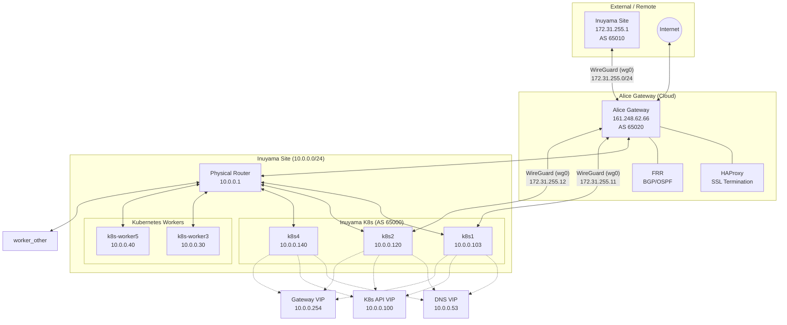
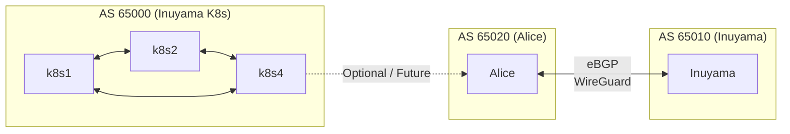

# ネットワーク構成ドキュメント

このドキュメントでは、kigawa-net インフラストラクチャのネットワーク構成について説明します。

## 概要

本ネットワークは、BGPによる動的ルーティング、VRRP (Keepalived) による高可用性、およびWireGuardによるVPN接続を組み合わせたハイブリッド構成となっています。

## コンポーネント

### 1. BGP ルーティング (FRR)

ネットワーク全体のルーティング制御にBGPを使用しています。コントロールプレーンノード(k8s1, k8s2, k8s4)の BGP は、2026-10-06 に BIRD から FRR へ移行しました(#210)。

- **iBGP フルメッシュ**: Kubernetes コントロールプレーンノード（k8s1, k8s2, k8s4）間でiBGPフルメッシュが構成されています。
    - **ソフトウェア**: [FRR (Free Range Routing)](https://frrouting.org/)(ホストの systemd サービス `frr.service`: zebra + bgpd。apt のパッケージ)
    - **設定ファイルパス**: `/etc/frr/frr.conf`(`hardware/modules/bgp-frr` が生成)
    - **ピアリング設定**: 各ノードの `frr.conf` に、他のコントロールプレーンノードが iBGP の隣接ノードとして定義されています(`next-hop-self`)。
    - **確認**: `vtysh -c 'show bgp ipv4 unicast summary'`、`ip route show proto bgp`
- **AS番号**: `65000` (Inuyama K8s) を主に使用しています。外部ピア(IONOS・Oracle)とは `local-as 65010 no-prepend replace-as` で接続します。
- **広告ルート**:
    - **DNS VIP (10.0.0.53)**: 各コントロールプレーンノードが自身の `lo` にこのIPをアサインし、`network` 文でBGP経由で広告します。
    - **直結経路の再配布**: `redistribute connected` を、許可リスト(`redistribute_connected_prefixes`)付きで使います。BIRD の `protocol direct` のように全ての直結経路は流しません。API VIP(`10.0.0.100/32`)とゲートウェイ VIP(`10.0.0.254/32`)は、保持ノードの直結経路として伝搬します。
    - **Kubernetes サービスネットワーク**: kube-vip 等を通じて広告される場合があります。
- **kube-vip との BGP**: 同一ホストの kube-vip と FRR の BGP は張れません(FRR は `127.0.0.x` を BGP の自分側に使えず、自ノードのアドレスを neighbor に指定できず、kube-vip が送る next-hop は自ノードのアドレスのため `martian or self next-hop` で破棄されます)。kube-vip は VIP を保持ノードのインターフェースに付けるだけで、広告は直結経路の再配布が担います。kube-vip の `bgp_peeraddress`(`127.0.0.2`)は、消さずに残します(ピア 0 件だと kube-vip が落ちる)。FRR は接続を拒否するだけで、kube-vip のログに接続エラーが出ます。詳細は `hardware/modules/bgp-frr/README.md`。
- **移行の記録**: `hardware/modules/bgp-frr/RUNBOOK-step2-k8s1.md`(切り替え手順と、k8s1・k8s2・k8s4 の実施結果)。
- **Alice Gateway (FRR)**: `alice` ノードで [FRR (Free Range Routing)](https://frrouting.org/) が動作しています。
    - **役割**: 外部ピアとの接続、OSPFによる内部ルートの学習、WireGuardインターフェース経由のルーティング。

### 2. DNS インフラストラクチャ

高可用なDNSリゾルバーサービスを提供しています。

- **DNS VIP**: `10.0.0.53`
    - このIPはBGPによってネットワーク全体に広告され、Anycastのように最も近い（またはECMPによって分散された）ノードがリクエストを処理します。
- **Knot Resolver (kresd)**:
    - 各コントロールプレーンノードでコンテナまたはサービスとして動作。
    - `/etc/knot-resolver/kresd.conf` にて、`0.0.0.0` および `DNS VIP (10.0.0.53)` で Listen するよう設定されています。
- **Knot DNS (Authority)**:
    - 権威DNSサーバーとして動作。
    - 管理ゾーン: `kigawa.net`, `onemc.world`
    - ゾーンファイルは `hardware/zones/` 下で管理されています。

**重要: LANスイッチ(AT-x510-28GTX, `192.168.1.1`)のDNS中継設定**

`192.168.1.0/24` LAN上の一般クライアント(ワークステーション等)は、DHCPで
配布されるデフォルトのネームサーバーとしてこのスイッチ(`192.168.1.1`/
`10.0.0.1`)を使うことが多い。スイッチは `ip dns forwarding` (簡易DNS中継、
ドメイン別のオーバーライドやキャッシュ制御はできない) で `ip name-server`
に設定した上位DNSへ単純に問い合わせを転送するだけの機能しかない。

この `ip name-server` は、**各コントロールプレーンノードの kresd の LAN アドレス**
(`192.168.1.103`(k8s1)、`192.168.1.20`(k8s2)、`192.168.1.120`(k8s4))だけを
指すようにすること。`10.0.0.53`(DNS VIP)は**指定しないこと**。

- **`10.0.0.53` を指定してはいけない理由**: スイッチにとって `10.0.0.0/24` は
  `vlan2` の直結サブネットのため、`10.0.0.53` を ARP で探す。VIP は各ノードの
  `lo` にあり、BGP でクラスタ内に広告されるだけで ARP には答えないため、
  スイッチから届かず、`no DNS response packet ... from 10.0.0.53` が出続けた
  (2026-10-05 判明・修正。#239)。
- 3台の kresd は、内部名(`k8s.kigawa.net` → `10.0.0.100`、`onemc.world` ゾーン)と
  外部名の両方を引ける。1台が落ちても、残りに回る。
- 過去に別の古い内部DNSサーバー(`192.168.1.113` 等)が `ip name-server` に
  残っていたことがあり、それらが `k8s.kigawa.net` 等の古い/誤ったレコード
  (移行前の `192.168.1.x` 系アドレス)を返し続けていたため、`kubectl` や他の
  クラスタ内サービスへの接続が数時間〜半日単位で断続的に失敗する原因になっていた
  (2026-08-12 判明・修正)。古いサーバーを残さないこと。

確認コマンド:
```
show running-config | include name-server
```
上の3つ以外のエントリがある場合は削除すること。端末側の確認は
`dig +short k8s.kigawa.net @192.168.1.1` が `10.0.0.100` を返すこと。

なお、`10.0.0.53` は、スイッチ(`192.168.1.1`)からは使えない。スイッチは `10.0.0.0/24` を `vlan2` の
直結として持ち、`10.0.0.53`(`lo` の anycast VIP)は ARP に答えないため。#241 の Core Router VIP
(`192.168.1.200/24`)ができても、スイッチの経路は変えない(下の 2.5 節)ので、状況は同じ。LAN の機器は、
各ノードの kresd の LAN アドレス(`192.168.1.103` / `.20` / `.120`)を使う。

作業端末など、有線(`192.168.1.1`)と無線(別ルーター)の両方が DefaultRoute の
場合、無線側の DNS が `k8s.kigawa.net` を公開 IP に解決することがある。
`resolvectl domain <有線 IF> ~kigawa.net ~onemc.world` で、内部ドメインを
有線の DNS に固定する。

### 2.5 workerノードから内部ネットワーク(10.0.0.0/24)への経路

workerノードは `192.168.1.0/24` のみに接続され、BGPピアではない(BGP デーモンは動かない)。
そのままではデフォルトゲートウェイ(物理スイッチ `192.168.1.1`)に `10.0.0.0/24` 宛を
送出してしまい到達できない(issue #154 / #193)。DNS VIP `10.0.0.53` や Keycloak/Ingress
VIP `10.0.0.240` に届かず、CoreDNSのforward失敗やadmin-panelのJWKS取得失敗の原因になる。

対策として、全workerに以下の静的経路を入れる。k8s1/k8s2/k8s4 は自宅LAN側にもアドレスを持ち
`ip_forward=1` のため、これらの keepalived(VRRP)が持つ **Core Router VIP(`192.168.1.200`)** を
next-hop にする(#241)。

```
ip route replace 10.0.0.0/24 nexthop via 192.168.1.200 weight 1
```

- **なぜスイッチ(`192.168.1.1`)に任せないか**: スイッチは `10.0.0.0/24` を `vlan2` の直結として持つため、
  サービスの VIP(LoadBalancer の `10.0.0.50`〜`.62`、`.240`〜`.243`、DNS の `10.0.0.53`)に届かない
  (ARP に答えない、またはスイッチの `vlan2` から見えない)。これらは、コントロールプレーンの各ノードが
  ローカルの VIP(`kube-ipvs0` や `lo`)として受け取り、Pod に振り分ける。そのため、コントロールプレーンの
  ノードをゲートウェイにして、`10.0.0.0/24` を渡す。
- **なぜ VIP 1 本か**: 以前は k8s1 / k8s2 / k8s4 の 3 台への ECMP だった。ECMP のハッシュ方式が既定
  (`fib_multipath_hash_policy=0`)のため、あるゲートウェイがダウンすると、そこに振られる通信が常にそこへ
  流れ続け、`no route to host` になった(2026-10-05、k8s2 のダウン中に worker3 が NotReady になった)。
  VRRP の failover(約 1 秒)に任せることで、この固定を無くす。負荷分散はなくなる(MASTER の 1 台に集まる)。

- 定義: `hardware/modules/cluster-route`(Terraform。`k8s-worker3` / `k8s-worker5` から利用)
- 自己修復: `cluster-route.timer` が1分ごとに `cluster-route.service` を再実行する
  (`ip route replace` は冪等)。経路が何らかの理由で失われても最大1分で復旧する
  (2026-10-03、経路が失われたままCoreDNSのタイムアウトが約3時間続いた事象への対策)
- 確認コマンド(worker上):
  ```
  ip route get 10.0.0.53          # via 192.168.1.{103,20,120} になること
  systemctl list-timers cluster-route.timer
  dig +short +time=2 +tries=1 @10.0.0.53 kigawa.net
  ```
- 注意: `k8s-worker1` / `k8s-worker4` は現状 `hardware/` に Terraform 定義がなく、同じ経路を
  手動で設定している(2026-10-06 に、Core Router VIP 1 本に変更。`/usr/local/bin/cluster-route.sh` と
  `cluster-route.service`。変更前のスクリプトは各ノードの `/root/cluster-route.sh.bak-20261006`)。
  `cluster-route.timer`(1 分ごとの再適用)は無いので、経路が消えても自動では復旧しない。
  IaC への取り込みは #198 で追跡する。

### 3. 高可用性 (VRRP / Keepalived / kube-vip)

- **Keepalived (VRRP)**:
    - Terraformモジュール `hardware/modules/keepalived` を通じて管理されます。
    - **VRRP (Virtual Router Redundancy Protocol)** を使用して、特定の物理インターフェース上でVIPを浮動させます。
    - **役割**: 主にゲートウェイや特定のサービスにおけるVIPの冗長化に使用されます。
    - **設定**: `/etc/keepalived/keepalived.conf` にて VRRP インスタンス、優先度（Priority）、仮想ルーターID（Virtual Router ID）、認証パスワード、および管理対象のVIPが定義されます。
    - **VRRP インスタンス**(k8s1 / k8s2 / k8s4 の3台。同じ優先度の順: k8s1=110、k8s2=100、k8s4=90):

      | インスタンス | VRID | VIP | 用途 |
      |---|---|---|---|
      | `VI_1` | 1 | `10.0.0.254/32` | 内部(`10.0.0.0/24`)側のゲートウェイ VIP |
      | `VI_CORE` | 2 | `192.168.1.200/24` | **Core Router VIP**(#241)。LAN(`192.168.1.0/24`)側の仮想コアルーターの next-hop。worker の `10.0.0.0/24` 宛の経路(2.5 節)が使う |

    - **Core Router VIP のヘルスチェック**: `/etc/keepalived/check-core-router.sh`(IP 転送が有効で、BGP が `:179` で待ち受け中で、kube-proxy が `http://127.0.0.1:10256/healthz` に 200 を返す)。失敗すると、`VI_CORE` の優先度が 30 下がり(`weight -30`)、別のノードに VIP が移る。`vrrp_script` には `enable_script_security` が必要で、`VI_CORE` があるときだけ `global_defs` で有効にしている。kube-proxy を見るのは、worker の `10.0.0.0/24` 宛の通信が、この VIP の MASTER 1 台に集まり、サービスの VIP(`kube-ipvs0` / `lo`)の振り分けを kube-proxy に頼っているため(#252)。`interval 2` / `fall 2` なので、2 回連続(約 4 秒)で失敗すると、優先度が下がる。
    - **failover**: MASTER の keepalived を止めると、約1秒で、別のノードが MASTER になる(2026-10-06 の試験。worker3 から DNS・API へ 0.3 秒間隔で 224 回アクセスして、失敗 0 回)。突然ノードが落ちた場合は、`advert_int` の3倍(約3秒)で引き継ぐ想定(未試験)。
    - **設定の反映**: `systemctl reload-or-restart keepalived`(reload を優先する。既存の `VI_1` の VIP は、reload では外れない)。
    - **確認**:
      ```
      ip -4 addr show | grep -E "192\.168\.1\.200|10\.0\.0\.254"   # MASTER のノードだけに出る
      journalctl -u keepalived --since "-10min" | grep -E "VI_CORE|VI_1|chk_core"
      ```
- **kube-vip**:
    - Kubernetes コントロールプレーンのAPIサーバー VIP (例: 10.0.0.100) を管理します。
    - **BGPモード**: 本環境ではBGPモードを推奨し、ARPモードは利用しません。これにより、レイヤー2の制限を受けずに柔軟なルーティングが可能になります。
    - 各コントロールプレーンノード上でスタティックポッドとして動作し、APIサーバーの可用性を担保します。

### 4. ゲートウェイ (Alice)

`alice` ノードは、ネットワークの境界ゲートウェイとして以下の機能を果たします。

- **FRR**:
    - BGP/OSPFによるルーティング制御。
    - 外部ネットワークへのルート集約や、内部ネットワークへのデフォルトルートの配布などを行います。
- **HAProxy**:
    - 外部（インターネット）からのリバースプロキシとして動作。
    - SSL終端を行い、バックエンドの各サービス（Kubernetes Ingressなど）にトラフィックを振り分けます。
- **WireGuard**:
    - `wg0` インターフェースを使用し、外部拠点やモバイルクライアントとのセキュアな通信路を提供します。
    - WireGuardネットワーク内のルーティングはFRRによって管理される場合があります。
    - **ピア構成** (`172.31.255.0/24`):
        - Inuyama サイトゲートウェイ (`172.31.255.1`) — eBGP 接続、LAN (`192.168.1.0/24`) へのルーティング
        - k8s1 (`172.31.255.11`) — 直接ピア
        - k8s2 (`172.31.255.12`) — 直接ピア

## ネットワーク構成図

### 1. 物理・論理トポロジー


```mermaid
graph TB
    subgraph "External / Remote"
        Inuyama[Inuyama Site<br/>172.31.255.1<br/>AS 65010]
        Internet((Internet))
    end

    subgraph "Alice Gateway (Cloud)"
        Alice[Alice Gateway<br/>161.248.62.66<br/>AS 65020]
        HAProxy[HAProxy<br/>SSL Termination]
        FRR[FRR<br/>BGP/OSPF]
        Alice --- HAProxy
        Alice --- FRR
    end

    subgraph "Inuyama Site (10.0.0.0/24)"
        subgraph "Inuyama K8s (AS 65000)"
            k8s1[k8s1<br/>10.0.0.103]
            k8s2[k8s2<br/>10.0.0.120]
            k8s4[k8s4<br/>10.0.0.140]
        end

        subgraph "Kubernetes Workers"
            worker3[k8s-worker3<br/>10.0.0.30]
            worker5[k8s-worker5<br/>10.0.0.40]
        end

        Router[Physical Router<br/>10.0.0.1]
    end

    %% Connections
    Internet <--> Alice
    Inuyama <-- "WireGuard (wg0)<br/>172.31.255.0/24" --> Alice
    k8s1 <-- "WireGuard (wg0)<br/>172.31.255.11" --> Alice
    k8s2 <-- "WireGuard (wg0)<br/>172.31.255.12" --> Alice
    Alice <--> Router
    Router <--> k8s1
    Router <--> k8s2
    Router <--> k8s4
    Router <--> worker3
    Router <--> worker5
    Router <--> worker_other

    %% VIPs
    k8s1 -.-> VIP_DNS[DNS VIP<br/>10.0.0.53]
    k8s2 -.-> VIP_DNS
    k8s4 -.-> VIP_DNS

    k8s1 -.-> VIP_K8S[K8s API VIP<br/>10.0.0.100]
    k8s2 -.-> VIP_K8S
    k8s4 -.-> VIP_K8S

    k8s1 -.-> VIP_GW[Gateway VIP<br/>10.0.0.254]
    k8s2 -.-> VIP_GW
    k8s4 -.-> VIP_GW
```

### 2. BGP ピアリング構成


```mermaid
graph LR
    subgraph "AS 65000 (Inuyama K8s)"
        k8s1 <--> k8s2
        k8s2 <--> k8s4
        k8s4 <--> k8s1
    end

    subgraph "AS 65020 (Alice)"
        Alice
    end

    subgraph "AS 65010 (Inuyama)"
        Inuyama
    end

    Alice <-- "eBGP<br/>WireGuard" --> Inuyama
    k8s4 -. "Optional / Future" .-> Alice
```

## IPアドレス設計

Inuyamaサイト（`10.0.0.0/24`）では、管理の容易性と将来の拡張性を確保するため、以下のサブネットポリシーに基づいてIPアドレスを割り当てています。また、既存の `192.168.1.0/24` も管理用として維持されます。

### 1. サブネットポリシー

| IPレンジ | 用途 | 備考 |
|----------|------|------|
| `10.0.0.1` - `.9` | 物理インフラ / ネットワーク機器 | ルーター、スイッチ等 |
| `10.0.0.10` - `.49` | K8s Worker ノード | ワーカーノード物理IP |
| `10.0.0.50` - `.69` | ネットワークサービス VIP | DNS VIP (`10.0.0.53`) 等 |
| `10.0.0.100` - `.149` | K8s Control Plane ノード | ノード物理IP, API VIP |
| `10.0.0.150` - `.199` | 固定IPデバイス / 管理用ホスト | 監視、ストレージ等 |
| `10.0.0.200` - `.249` | サービス VIP | Ingress VIP, Minecraft VIP 等 |
| `10.0.0.250` - `.254` | ゲートウェイ VIP | デフォルトゲートウェイ (`10.0.0.254`) 等 |
| `192.168.1.0/24` | 管理用 / 旧ネットワーク | 既存デバイス、管理インターフェース |

### 2. 具体的なIP割り当て一覧

| IPアドレス | ホスト / 用途 | 管理方法 | カテゴリ |
|-----------|--------------|----------|----------|
| 10.0.0.1 | 物理ルーター | 静的割当 | インフラ |
| 10.0.0.254 | デフォルトゲートウェイ VIP | Keepalived (VRRP) | ゲートウェイ |
| 10.0.0.53 | DNS VIP | FRR (BGP広告) | VIP |
| 10.0.0.100 | K8s API VIP | kube-vip | CP (VIP) |
| 10.0.0.103 | k8s1 (Node) | 静的割当 | CP (Node) |
| 10.0.0.120 | k8s2 (Node) | 静的割当 | CP (Node) |
| 10.0.0.140 | k8s4 (Node) | 静的割当 | CP (Node) |
| 10.0.0.30 | k8s-worker3 | 静的割当 | Worker |
| 10.0.0.40 | k8s-worker5 | 静的割当 | Worker |
| 10.0.0.240 | Ingress VIP | kube-vip / BGP | VIP |
| 10.0.0.241 | Minecraft VIP | kube-vip / BGP | VIP |
| 161.248.62.66 | Alice Gateway (Public) | 静的割当 | Alice |
| 172.31.255.2/24 | Alice Gateway (WG) | WireGuard | Alice |
| 172.31.255.1 | Inuyama Gateway (WG) | WireGuard | Inuyama |
| 172.31.255.11 | k8s1 (WG) | WireGuard | Inuyama |
| 172.31.255.12 | k8s2 (WG) | WireGuard | Inuyama |
| 10.244.0.0/16 | Pod ネットワーク | Flannel | K8s Internal |
| 10.96.0.0/12 | Service ネットワーク | Kubernetes | K8s Internal |
| 192.168.1.103 | k8s1 (旧IP/管理) | 静的割当 | 管理 |
| 192.168.1.20 | k8s2 (旧IP/管理) | 静的割当 | 管理 |
| 192.168.1.120 | k8s4 (旧IP/管理) | 静的割当 | 管理 |
| 192.168.1.253 | main (作業用ホスト) | 静的割当 | 管理 |
| 192.168.1.254 | 旧ゲートウェイ | 静的割当 | 管理 |
